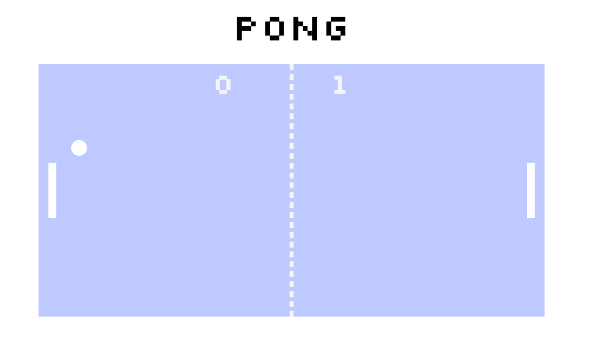
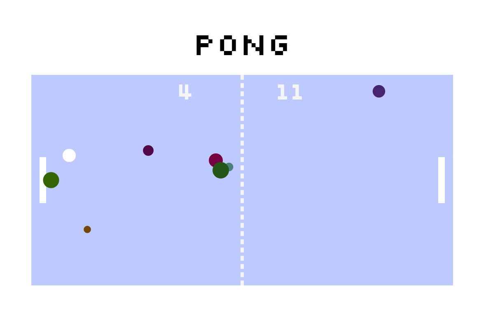

# Pong Game

A basic pong game using SVGs.

## Setup

**Install dependencies:**

`> npm i`

**Run locally with Webpack Dev Server:**

`> npm start`

**Build for production:**

`> npm run build`

## Keys

**Player 1:**
* a: up
* z: down
* x: colourful surprise!

**Player 2:**
* arrow-up : up
* arrow-down: down
* arrow-right: colourful surprise!

This is a pong game built by Camden Shaw for Red Academy's Web Development course.

# Technologies Used Are

`npm   javascript    es2016 and beyond   eslint      json        yarn        webpack     VS Studio Code    babel     python  Macintosh`

# Learnings

I learned a lot about javascript classes and node use in this project.  It was difficult to wrap my head around at first, but I believe I have the hang of it now.  Not being able to alter a variable in a node other than the one it was created in was a bit of a setback, I found (getting the 'x is read-only' error), but I was able to figure out how to work around it.

The stretch-goals I strode for were to press a button to release balls (x for player 1, right-arrow for player2), serve to a random side for the first serve, make the balls different colours and to declare a winner after a score of 20points.  I am glad I chose to go beyond the stretch goal and introduce a limit to the number of balls that could be added as it was a great and very needed exercise in the "array.splice()" command.  I didn't really get it from before, but I finally wrapped my head around it in this project.  The key thing I didn't understand was that I needed more than one declaration to make it work properly.  I had array.splice(index#) when I needed array.splice(index#, #of items to remove) for this use, although I could list items after the #of items to remove to add items to the array at the splice point.  Very simple once you understand and remember it.  Lots of hair has been lost to that simple mistake; I am sure I will never forget now.

I also modified the parameters of the paddles so that the balls can pass behind them without acting as though the balls hit the paddles.  I added the ability to press the spacebar in order to start a new game after a winner has been declared.  For the balls added on keypress, I randomized the size and color for a bit of an extra "wow" - it feels very 90's.

If I hadn't come down with a mild case of food-poisoning on Saturday I would have liked to try to add a 'spin' element to the ball and ad a lazer blast to player 2's paddle in place of initiating extra balls (with the ability to destroy the coloured balls) to give players 1 and 2 their own specialties.  Overall I am happy with what I accomplished, however.

